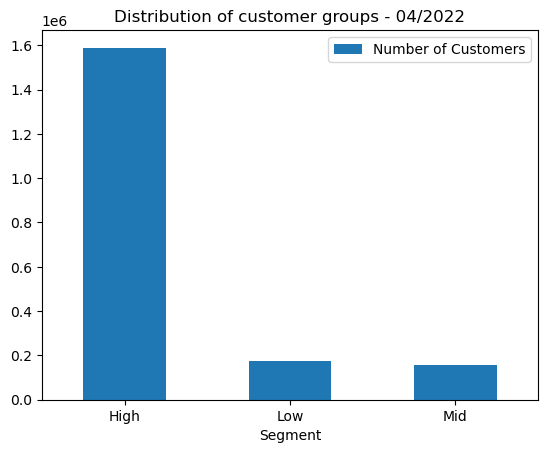

# CustomerBehavior

## **1. Introduction**
- **User Behavior Analysis and Customer Segmentation** is a project that aims to understand how users interact with a product or service, and to group users into segments based on their behavior. This information can be used to improve the product or service, to target marketing campaigns more effectively, and to reduce customer churn.

- User behavior analysis is the process of collecting and analyzing data on how users interact with a product or service.  Customer segmentation is the process of dividing a customer base into smaller groups based on their shared characteristics. This can be done using a variety of criteria. 

## **2. ETL data and Analyze**  
**- ETL data: using Pyspark, SQL, WampServer**  
1. Extract → Convert raw data into a format that is suitable for loading into a data warehouse.
2. This involves cleaning, converting, combining, and creating new data fields. 

**- Analyze: using Pandas, Matplotlib, and Seaborn**
1. Find the categories viewed and what is the most viewed category.  
2. Calculate IQR to understand how time spent is allocated to each category.
3. Use RFM to segment customers to inform future strategy.

## **3. Goal**
User behavior analysis and customer segmentation are often used together. By understanding how users interact with a product or service, businesses can create customer segments that are more likely to be interested in specific features or marketing campaigns. This can lead to improved customer satisfaction and increased revenue.

  

