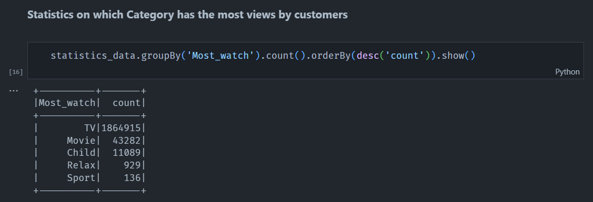

# Customer Behavior
  <div>
     &nbsp  &nbsp  &nbsp  &nbsp 
  </div>

## **1. Introduction**
**User Behavior Analysis and Customer Segmentation** is a project designed to gain insights into user interactions with a product or service. The primary goal is to group users based on their behavior, providing valuable information for product/service enhancement, targeted marketing, and reducing customer churn.

**What is User Behavior Analysis?**
> User behavior analysis involves collecting and analyzing data on how users interact with a product or service. This project utilizes various criteria to understand user actions, preferences, and engagement patterns.

**What is Customer Segmentation?**
> Customer segmentation is the process of categorizing a customer base into smaller groups based on shared characteristics. This segmentation is crucial for tailoring strategies that resonate with specific customer profiles.

## **2. Installation and Setup Environment Variables**
- **PYTHON**
  
  If your device already has Python, skip this step, otherwise download it [here](https://docs.conda.io/projects/miniconda/en/latest/).

- **JAVA**
  
  - To confirm that Java's installed on your machine,  just open cmd and type java -version. You should be able to see the version of Java installed on your system. Otherwise, download [here](https://www.oracle.com/java/technologies/downloads/#jdk18-windows).
  
  - After finishing the installation with default settings. Now, open the system environment variables dialogue.
  
  - Click the **Environment Variables...** button.
  
  - Click the **New…** button in the System Variables section.
  
  - Then, type **JAVA_HOME** in the **Variable name** field and provide your **JDK installation path** in the **Variable value** field. 
  	  
    It should look like:
  <p align="center">
    
  </p>

  - Now click **OK**.
  - Then, click the **Path** variable in the **System Variable** section under the Environment Variables dialogue box you just opened.
  - Edit the path and click the **New** button and add **“%JAVA_HOME%\bin”** at the end of it.
   
    It should look like:
  <p align="center">
    
  </p>

- **SPARK**
  
  - Download [Apache Spark](https://spark.apache.org/downloads.html).
  <p align="center">
    
  </p>

  - Download that file, then create a **Spark** folder, extract the downloaded file into that folder.

  - Then go back to **system environment variable** to create **SPARK_HOME** and add the **"%SPARK_HOME%\bin"** to **Path** variable in the **System Variables** section under the Environment Variables dialogue box you just opened. **Same with JAVA installation.**

- **HADOOP**  

  - Create another folder named **Hadoop** → then go to this github [link](https://github.com/steveloughran/winutils) → select hadoop 3.0 → go to bin → download the winutils.exe file and place it in the **Hadoop** folder.
  <p align="center">
    
  </p>

  - Go back to **system environment variable** to create **HADOOP_HOME** and add the **"%HADOOP_HOME%\bin"** to **Path** variable in the **System Variables** section under the Environment Variables dialogue box you just opened.

## **3. ETL data and Analyze**
###  **3.1 ETL data: using Pyspark, SQL, WampServer**
  - Because the data is aggregated from many small files, I handled each small file as follows: Raw data was **extracted** and then **transformed** into a format that is suitable for loading into a data warehouse. (This involves cleaning, converting, combining, and creating new data fields.)
  ```python
  def etl_1_day(path, file_name):
    df = read_data(path, file_name)
    df = df.withColumn('Category',
                       when((col('AppName') == 'KPLUS') | (col('AppName') == 'CHANNEL'), 'Truyền Hình')
                      .when((col('AppName') == 'VOD') | (col('AppName') == 'FIMS') | (col('AppName') == 'BHD'), 'Phim Truyện')
                      .when((col('AppName') == 'RELAX'), 'Giải Trí')
                      .when((col('AppName') == 'CHILD'), 'Thiếu Nhi')
                      .when((col('AppName') == 'SPORT'), 'Thể Thao')
                      .otherwise('Error'))
    
    date_of_file = (file_name[:4] + '-' + file_name[4:6] + '-' + file_name[6:]).replace('.json', '')
    df = df.withColumn('Date', lit(date_of_file))
    
    df = df.select('Contract', 'Date', 'Category', 'TotalDuration')
    df = df.filter(df.Category != 'Error')    

    df = df.groupBy('Contract', 'Date', 'Category').sum()
    df = df.withColumnRenamed('sum(TotalDuration)', 'TotalDuration')

    # ------ CHECK OUTLIER ------
    df = df.filter((df['TotalDuration'] >= 0) & (df['TotalDuration'] <= 86400))

    print('Finished Processing {}'.format(file_name))
    return df
  }
  ```
  - After processing each file, I will combine them into one large dataframe that I created at the beginning.
  ```python
  def main_task():
    path = "C:\\Users\\NKNhu\\LearnBigData\\Dataset\\log_content\\"
    list_file = os.listdir(path)
    file_name1 = list_file[0]
    df = etl_1_day(path, file_name1)
    for i in list_file[1:]:
        file_name2 = i 
        df_ = etl_1_day(path ,file_name2)
        df = df.union(df_)
        df = df.cache()
  ```
  - Finally, I imported the ETL data into a MySQL server in **WampServer** so that it could be stored, examined, and analyzed later.
  ```python
  def import_data_to_mysql(data, table_name):
    url = 'jdbc:mysql://' + 'localhost' + ':' + '3306' + '/' + 'customer_360_platform'
    driver = "com.mysql.cj.jdbc.Driver"
    user = 'root'
    password = ''
    data.write.format('jdbc').option('url', url) \
                             .option('driver', driver) \
                             .option('dbtable', table_name) \
                             .option('user', user) \
                             .option('password', password) \
                             .mode('append').save()
    return print('Data imported successfully.')
  ```

###  **3.2 Analyze: using PySpark, Pandas, Matplotlib, SQL, and WampServer**
### - Find the categories viewed and what is the most viewed category.
  <p align="center">
    
  </p>

### - Calculate IQR to understand how time spent is allocated to each category.
    
  *What is Interquartile Range IQR?*
    
  > - **IQR** is used to measure variability by dividing a data set into quartiles. The data is sorted in ascending order and split into 4 equal parts. Q1, Q2, Q3 called first, second and third quartiles are the values which separate the 4 equal parts.
  > - Q1 represents the 25th percentile of the data.
  > - Q2 represents the 50th percentile of the data.  
  > - Q3 represents the 75th percentile of the data.

  <p align="center">
    
  </p>

### - Use RFM to segment customers to inform future strategy.
  *What Is Recency, Frequency, Monetary Value **(RFM)**?*

  > - **Recency, frequency, and monetary value (RFM)** is a model used in marketing analysis that segments a company’s consumer base by their purchasing patterns or habits. In particular, it evaluates **customers’ recency** (how long ago they made a purchase or used a product), **frequency** (how often they make purchases or use a product), and **monetary value** (how much money or time they spend).
  > - **RFM** is then used to identify a company’s or an organization’s best customers by measuring and analyzing spending habits to improve low-scoring customers and maintain high-scoring ones.  
  <br>
  <p align="center">
    
  </p>

## **4. Goal**
User behavior analysis and customer segmentation are often used together. By understanding how users interact with a product or service, businesses can create customer segments that are more likely to be interested in specific features or marketing campaigns. This can lead to improved customer satisfaction and increased revenue.

## License
[MIT](https://choosealicense.com/licenses/mit/)